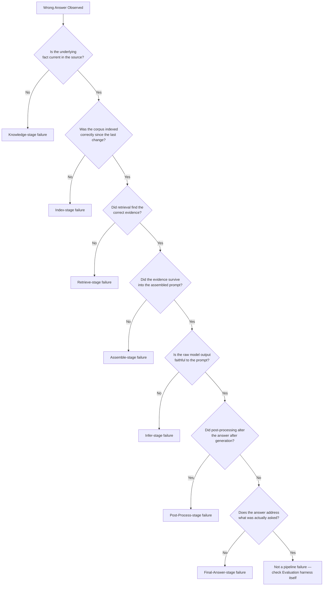

# AI Lifecycle Traceability Model (ALTM)

**Repository:** `ai-quality-engineering`
**Status:** Milestone 0.5 — Diagnostic Framework Locked
**Related documents:** `docs/architecture.md` (system design), `docs/roadmap.md` (execution plan), `docs/glossary.md` (terminology)

| If you want to understand... | Read |
|---|---|
| What is being built | `docs/roadmap.md` |
| How the system is designed | `docs/architecture.md` |
| How failures are diagnosed | `docs/altm.md` |
| Terminology | `docs/glossary.md` |

This document is the operational diagnostic manual for the repository. It exists to answer one question:

> **Given an incorrect AI response, how do we systematically determine where the failure originated?**

Every section below supports answering that question. AI concepts are explained only to the extent they aid failure diagnosis — general RAG or LLM background lives in `docs/glossary.md`, not here.

---

## 1. Purpose

Traditional software QA traces execution — which line, which service, which layer failed. Traditional ETL testing traces data movement — which transformation, which source, which row failed. AI systems require an equivalent discipline, but the thing being traced is neither pure execution nor pure data movement: it is **information moving through a multi-stage pipeline over time**, where each stage has its own responsibility and its own failure mode.

The AI Lifecycle Traceability Model (ALTM) is the reasoning framework used in this repository to perform that trace. Given an observed failure, ALTM provides a structured path from "the answer was wrong" to "here is the specific stage, component, and metric that explains why."

**ALTM is an internal engineering framework developed for this repository.** It is not an industry standard, not a published academic model, and not a claim of novelty. It is a structured way of reasoning about failures, built from direct diagnostic work on this project's own pipeline (see Section 8).

## ALTM Diagnostic Reasoning

ALTM is not simply a list of lifecycle stages to memorize. It is a structured reasoning process an engineer walks through when a failure is observed:

```text
Observed Symptom
        │
        ▼
Failure Localization
        │
        ▼
Evidence Collection
        │
        ▼
Root Cause
        │
        ▼
Corrective Action
```

Engineers begin with an observed symptom — a wrong answer, a stale fact, a hallucinated claim — not with a stage. From there, evidence is gathered stage by stage, in pipeline order, rather than guessed at from the symptom alone. Each stage has its own check (Section 4), and the reasoning process applies those checks in sequence until one of them fails.

The objective at every step is the same: identify the *first* lifecycle stage where evidence fails, not the stage where the symptom happened to surface. Corrective action is then always applied at that stage — the stage where the check first fails — rather than at the stage where the symptom was observed. This is what separates ALTM from ad hoc debugging: the reasoning process is fixed even though the failure being traced is different every time.

---

## 2. Relationship to Architecture

`docs/architecture.md` and this document answer different questions and are not interchangeable.

| Architecture | ALTM |
|---|---|
| System design | Failure diagnosis |
| Components | Failure localization |
| Interfaces | Evaluation strategy |
| Data flow | Root cause analysis |
| "How is this built?" | "Why did this go wrong?" |

Architecture is the map. ALTM is the procedure for using the map when something doesn't match reality. This document assumes the reader already knows the component boundaries and interfaces defined in `docs/architecture.md` — they are not re-explained here.

In short, `docs/architecture.md` defines the structural map of the system, and this document defines the diagnostic procedure that operates on that map. The two documents intentionally evolve independently: architectural changes (new components, changed interfaces, a new milestone) update `docs/architecture.md`; newly discovered failure modes update this document. Neither document duplicates the other's content — architecture is not re-derived here, and diagnostic procedure is not re-derived there.

---

## Runtime Lifecycle vs Diagnostic Lifecycle

ALTM intentionally separates system execution from system diagnosis — these are two different directions through the same eight stages, not two different pipelines.

Runtime executes forward, producing an answer:

```text
Knowledge
    │
    ▼
Index
    │
    ▼
Retrieve
    │
    ▼
Assemble
    │
    ▼
Infer
    │
    ▼
Post-Process
    │
    ▼
Evaluate
    │
    ▼
Final Answer
```

Diagnosis intentionally walks backward from an observed failure:

```text
Observed Failure
        │
        ▼
Final Answer
        │
        ▼
Evaluate
        │
        ▼
Post-Process
        │
        ▼
Infer
        │
        ▼
Assemble
        │
        ▼
Retrieve
        │
        ▼
Index
        │
        ▼
Knowledge
```

The goal of walking backward is to locate the earliest lifecycle stage where evidence no longer supports the expected behavior. This upstream-first approach prevents engineers from fixing downstream symptoms while leaving upstream causes unresolved — the same principle Section 7's Root Cause Analysis Workflow applies in decision-tree form.

---

## 3. The AI Lifecycle

ALTM traces eight stages. This is the canonical, full-resolution version of the lifecycle; `docs/architecture.md` presents a six-stage summary for system-design purposes, which is a deliberate simplification of the same pipeline, not a different one.

```
Knowledge → Index → Retrieve → Assemble → Infer → Post-Process → Evaluate → Final Answer
```

| Stage | Purpose | Inputs | Outputs | Typical Failures | Typical Metrics | Responsible Component (per `architecture.md`) |
|---|---|---|---|---|---|---|
| **Knowledge** | Establish and maintain a trustworthy source corpus | Resume, job descriptions, JobOps SQLite | Validated, current document set | Stale or incorrect corpus; unsynced edits | Freshness checks (content hash + timestamp) | Knowledge Source |
| **Index** | Convert validated documents into retrievable units | Validated document set | Chunks + vectors | Missing or malformed chunks; truncated content | Chunk coverage, embedding coverage | Chunker, Indexer |
| **Retrieve** | Fetch evidence relevant to a query | Query, indexed corpus | Ranked candidate chunks | Wrong document/version retrieved; noisy results | Context Precision, Context Recall (Ragas) | Retriever |
| **Assemble** | Build the final prompt from retrieved evidence | Ranked chunks, query | Assembled prompt | Correct evidence retrieved but dropped or truncated during assembly | Prompt assembly validation (unit/integration tests) | Context Builder |
| **Infer** | Generate an answer from the assembled prompt | Assembled prompt | Raw model output | Unsupported or fabricated claims; blended parametric and retrieved knowledge without distinction | Faithfulness, Groundedness, Hallucination Rate (DeepEval) | Generator |
| **Post-Process** | Apply guardrails or transformations after generation | Raw model output | Delivered output | Guardrail alters, strips, or reformats a correct answer into an incorrect one (or vice versa) | Guardrail / output-contract tests | Generator (guardrail layer) |
| **Evaluate** | Score outputs and detect regressions | Delivered output, Golden Dataset | Pass/fail + metric scores | Evaluation harness itself fails to run or silently misses a regression | Promptfoo (old vs. new diff) | Evaluation Engine |
| **Final Answer** | Confirm the answer addresses what was actually asked | Delivered output, original query | Accepted or flagged answer | Every upstream stage passes individually but the answer misses a stated requirement or exclusion | Answer Relevancy + task-specific rubric | Evaluation Engine |

## Lifecycle Traceability

Every lifecycle stage produces a tangible artifact, and that artifact becomes the evidence consumed by the next stage:

| Artifact | Produced By | Consumed By |
|---|---|---|
| Knowledge Corpus | Knowledge | Index |
| Indexed Chunks | Index | Retrieve |
| Retrieved Evidence | Retrieve | Assemble |
| Prompt | Assemble | Infer |
| Raw Output | Infer | Post-Process |
| Delivered Output | Post-Process | Evaluate |
| Evaluation Results | Evaluate | Engineer |

This traceability is what allows failures to be localized through observable artifacts rather than intuition. ALTM traces evidence, not assumptions — the Failure Localization Matrix (Section 5) and the Root Cause Analysis Workflow (Section 7) both depend on these artifacts existing and being inspectable, not on a plausible-sounding explanation.

---

## 4. Failure Semantics by Lifecycle Stage

For each stage: what can go wrong, how it manifests to an observer, how it is detected, and which evaluation layer (`docs/roadmap.md`, Section 5) is responsible for catching it.

**Knowledge**
- *Failure:* Corpus is stale or incomplete — a document was edited but the pipeline still reads the old version.
- *Symptom:* Answer is internally consistent and well-formed, but factually outdated.
- *Detection:* Content hash mismatch against the JobOps source; timestamp comparison.
- *Correction:* Re-sync or re-index the affected document. Layer 1 (Data Quality, pytest).

**Index**
- *Failure:* A chunk boundary splits a fact mid-sentence, or a document is only partially embedded.
- *Symptom:* Retrieval returns a chunk that references a fact without the fact itself.
- *Detection:* Chunk coverage check — every span of source text should exist in exactly one chunk with a corresponding vector.
- *Correction:* Fix chunking boundaries; re-index. Layer 1 (Data Quality, pytest).

**Retrieve**
- *Failure:* The right topic is matched but the wrong document, section, or version is returned; or irrelevant chunks crowd out relevant ones.
- *Symptom:* Answer discusses the right subject but cites the wrong specifics.
- *Detection:* Context Precision (noise in retrieved set), Context Recall (whether relevant material was found at all).
- *Correction:* Retrieval logic or ranking fix. Layer 2 (Retrieval Quality, Ragas).

**Assemble**
- *Failure:* Correct chunks were retrieved but did not survive prompt construction — context window overflow silently drops content.
- *Symptom:* Model behaves as if it never saw evidence that retrieval logs confirm was retrieved.
- *Detection:* Prompt assembly unit/integration tests — not an LLM metric.
- *Correction:* Software fix at the retrieval-to-generation seam, not a retrieval or generation change.

**Infer**
- *Failure:* Model states something not supported by the assembled prompt, or blends training-data knowledge with retrieved context without flagging the difference.
- *Symptom:* Answer contains a claim that sounds plausible but has no traceable source in the retrieved evidence.
- *Detection:* Faithfulness, Groundedness, Hallucination Rate.
- *Correction:* Prompt/generation tuning. Layer 3 (Generation Quality, DeepEval). Note: this stage never checks whether the retrieved evidence itself was current or correct — that is a Knowledge-stage concern (see Section 10, Principle 3).

**Post-Process**
- *Failure:* A guardrail or downstream agent modifies a correct answer into an incorrect one (or an incorrect answer is inadvertently corrected — either direction is a fault in this stage, not in Infer).
- *Symptom:* A hallucination check on pre-guardrail output passes, but the actually delivered answer is broken — or the reverse.
- *Detection:* Guardrail/output-contract tests, run against pre- and post-processing output separately.
- *Correction:* Guardrail logic fix. This stage is easy to miss because most evaluation tooling only ever inspects final output.

**Evaluate**
- *Failure:* The evaluation harness itself doesn't run, or a prompt/corpus/code change silently degrades quality without being caught.
- *Symptom:* A regression ships without any failing test.
- *Detection:* Promptfoo — re-run identical test cases against old vs. new prompt/corpus/code, diff results.
- *Correction:* Fix or extend the regression suite. Layer 4 (Regression, Promptfoo). Note: this is a comparison methodology applied across two full pipeline runs, not a stage the data itself flows through at runtime.

**Final Answer**
- *Failure:* Every upstream stage individually passes, but the answer doesn't address what was actually asked — e.g., it ignores a stated exclusion criterion.
- *Symptom:* Answer is faithful, grounded, and well-retrieved, but the person asking would still consider it a non-answer.
- *Detection:* Answer Relevancy plus a task-specific rubric.
- *Correction:* Prompt or task-framing fix. This is the only stage independent of truthfulness — a fully faithful, fully grounded answer can still fail here.

---

## 5. Failure Localization Matrix

Primary operational lookup table. Given an observed symptom, this narrows the likely stage before deeper investigation.

| Observed Symptom | Likely Stage | Responsible Component | Metric | Recommended Investigation |
|---|---|---|---|---|
| Hallucinated fact not in any source document | Infer | Generator | Faithfulness, Hallucination Rate | Check assembled prompt for the claim; if absent, it's fabricated at Infer |
| Answer cites the wrong document version | Knowledge | Knowledge Source | Freshness check | Compare corpus hash/timestamp against JobOps source |
| Right topic, wrong specific document retrieved | Retrieve | Retriever | Context Precision | Inspect ranked candidates for the query |
| Missing answer despite evidence existing in the corpus | Retrieve or Assemble | Retriever / Context Builder | Context Recall | Check whether evidence was retrieved at all vs. retrieved-but-dropped |
| Contradictory answer across repeated runs on the same input | Index or Infer | Indexer / Generator | Chunk coverage; determinism check | Confirm indexing is stable before suspecting generation non-determinism |
| Stale answer despite a recent source update | Knowledge | Knowledge Source | Freshness check | Verify re-indexing was triggered on the source change |
| Low recall on a known-answerable query | Retrieve | Retriever | Context Recall | Check ranking cutoff (top-k) and query formulation |
| Low precision on a known-answerable query | Retrieve | Retriever | Context Precision | Check for near-duplicate or loosely-related chunks crowding results |
| False confidence on an unanswerable question | Infer or Final Answer | Generator / Evaluation Engine | Hallucination Rate; abstention check | Confirm the "No Answer" failure-taxonomy category (`docs/roadmap.md`, Section 2.3) is represented in the Golden Dataset |
| Correct evidence retrieved, answer still wrong | Assemble or Infer | Context Builder / Generator | Prompt assembly tests; Faithfulness | Diff the assembled prompt against the retrieved chunk set before suspecting the model |
| Answer correct pre-guardrail, wrong as delivered | Post-Process | Generator (guardrail layer) | Guardrail/output-contract tests | Compare pre- and post-processing output directly |
| Regression after a prompt or corpus change, previously passing | Evaluate | Evaluation Engine | Promptfoo diff | Re-run the regression suite against the last known-good baseline |
| Faithful, grounded, but doesn't answer the actual question | Final Answer | Evaluation Engine | Answer Relevancy | Re-check the query against a task-specific rubric, not against truthfulness metrics |

---

## 6. Metric Mapping

| Metric | Stage | Why It Belongs There |
|---|---|---|
| Freshness checks (hash + timestamp) | Knowledge | Pure data engineering; not an LLM-specific metric |
| Chunk coverage, embedding coverage | Index | Verifies structural integrity of the corpus transformation, not relevance or truthfulness |
| Context Precision | Retrieve | Measures noise in retrieved evidence — has nothing to do with what is eventually said |
| Context Recall | Retrieve | Measures whether relevant evidence was found at all — also independent of generation |
| Prompt assembly tests | Assemble | A software correctness check at the retrieval-to-generation seam, not an AI quality metric |
| Faithfulness | Infer | Checks whether output is entailed by retrieved context |
| Groundedness | Infer | Checks whether each claim is individually traceable to cited evidence — stricter than Faithfulness |
| Hallucination Rate | Infer | Near-complement of Faithfulness in the simple case; not guaranteed to sum to 100% once partial/ambiguous claims exist |
| Guardrail/output-contract tests | Post-Process | Validates the delivered answer, which may differ from the raw model output |
| Promptfoo (regression diff) | Entire pipeline | Not a single-stage metric — a comparison methodology applied across two full runs of every stage |
| Answer Relevancy | Final Answer | The only metric independent of truthfulness; a fully faithful, fully grounded answer can still fail here |

The retrieval-vs-generation split is the single most load-bearing distinction in this table: Context Precision and Context Recall say nothing about what is eventually generated, and Faithfulness/Groundedness/Hallucination Rate say nothing about whether the retrieved evidence was itself correct or current. Every entry in Section 5 traces back to keeping this split intact.

---

## 7. Root Cause Analysis Workflow



The workflow moves strictly upstream to downstream. A failure at an earlier stage should be ruled out before investigating a later one, because later-stage metrics assume earlier stages behaved correctly (Section 10, Principle 3). Skipping this order is the most common cause of misdiagnosis — for example, treating a stale-Knowledge failure as a Retrieve-stage recall problem, because the symptom (missing or wrong information) looks similar at both stages.

---

## 8. Worked Example

**Observed failure:** The RCA Agent (HP AAVA) produces `Root Cause = Database Failure`. The client reports this is wrong.

**Trace through ALTM:**

1. **Knowledge** — Was the underlying data correct at the time of the run? Was Git synced? Were JIRA tickets current? *(If no: stop here — this is the failure.)*
2. **Index** — Did indexing actually run since the last data change? Was anything left unembedded? *(If no: stop here.)*
3. **Retrieve** — Did retrieval return the correct evidence, or a wrong-but-plausible chunk (e.g., a similar incident from a different service)? *(If no: stop here.)*
4. **Assemble** — Did the retrieved evidence survive into the final prompt, or did context-window truncation drop it silently? *(If no: stop here.)*
5. **Infer** — Were inference parameters (temperature, top-p, retries) reasonable? Did the model hallucinate despite correct, complete input? *(If yes to hallucination: stop here.)*
6. **Post-Process** — Did a guardrail or a downstream agent modify the answer after generation? *(If yes: stop here.)*
7. **Evaluate** — Did the Validation Agent and Faithfulness checks actually run against this case? Did they pass when they should have failed? *(If yes: the evaluation harness itself is the failure.)*

**Why adjacent stages were not responsible:** each stage's check is independent of the others — a passing Knowledge check says nothing about whether Retrieval found the right evidence, and a passing Faithfulness check at Infer says nothing about whether the evidence it was faithful *to* was itself correct. Locating the failure means finding the *first* stage in the sequence where the check fails, not the first stage where something looks suspicious.

**Corrective action:** determined by which stage the trace stopped at — a Knowledge failure is fixed by re-syncing the source; a Retrieve failure by fixing retrieval logic or ranking; an Infer failure by prompt or parameter tuning; and so on. The correction is always scoped to the stage identified, not applied broadly across the pipeline.

This example demonstrates the reframe ALTM enables: instead of debugging "the AI," the engineer debugs **the pipeline**, stage by stage — the same discipline as tracing a failure through a classical QA stack (Requirement → Design → Implementation → Database → API → UI → Testing).

---

## 9. Relationship to Evaluation Strategy

The four evaluation layers defined in `docs/roadmap.md` (Section 5) are the concrete tooling that operationalizes ALTM's stage-wise diagnosis:

| Evaluation Layer | ALTM Stages Covered |
|---|---|
| Layer 1 — Data Quality (pytest) | Knowledge, Index |
| Layer 2 — Retrieval Quality (Ragas) | Retrieve |
| Layer 3 — Generation Quality (DeepEval) | Infer |
| Layer 4 — Regression (Promptfoo) | Entire pipeline, compared across versions |

No single layer covers Assemble, Post-Process, or Final Answer as a dedicated automated metric in the current tool scope — these are validated through targeted unit/integration tests and task-specific rubrics rather than one of the three named evaluation tools. This is a known, accepted gap under the current three-tool scope freeze (`docs/roadmap.md`, Section 7), not an oversight.

Each layer measures a different lifecycle stage rather than "the system" as an undifferentiated whole — a system can pass Layer 3 (Faithfulness) while still failing Layer 1 (a stale but faithfully-summarized source), which is precisely the scenario in Section 4's Infer-stage note and the reason all four layers are required rather than any single one being sufficient on its own.

---

## 10. Design Principles

1. **One failure has one primary origin.** Even when a failure appears to touch multiple stages, diagnosis should identify the first stage in the pipeline order where a check genuinely fails — not every stage that looks affected.
2. **Earlier failures propagate.** A Knowledge-stage failure will typically cause every downstream stage to look "wrong" even though only one stage is actually broken. This is why the workflow in Section 7 moves strictly upstream to downstream.
3. **Passing one metric does not guarantee correctness elsewhere.** Faithfulness and Groundedness only ever check consistency with what was retrieved — never whether that retrieved content was itself current, complete, or correct.
4. **Diagnosis should move upstream, not stay local.** The instinct to fix the stage where a symptom is observed is often wrong; the fix belongs at the stage where the check first fails, which may be several stages earlier.
5. **Separate observation from explanation.** What was observed (the symptom) and why it happened (the stage-level root cause) are different things — the Failure Localization Matrix (Section 5) exists specifically to keep this distinction explicit rather than jumping straight to a fix.
6. **Evidence before intuition.** A stage is ruled in or out by running its specific check (Section 4), not by which explanation sounds most plausible.

---

## 11. Limitations

ALTM is an engineering reasoning framework built for this repository. It is explicitly **not**:

- An academic model or peer-reviewed contribution
- A published or industry-recognized standard
- A benchmarking framework or a substitute for one
- A replacement for observability tooling (tracing, logging, monitoring infrastructure)

Present ALTM in interviews and documentation as *"a mental model I use to reason about AI systems,"* never as *"an industry-standard framework."* The underlying ideas — lifecycle thinking, stage-wise evaluation, upstream-first diagnosis — are well-aligned with how enterprise AI systems are actually engineered. The name and the specific eight-stage breakdown are a personal synthesis for organizing and communicating those ideas, not a citation. Accuracy in this framing is itself part of what the framework is meant to demonstrate.

---

## 12. Future Evolution

| Milestone | ALTM Coverage |
|---|---|
| **Milestone 1A** | Knowledge stage fully exercised via the deterministic pipeline and Layer 1 (pytest). **Index stage exercised only in part** — see the qualification below. Retrieve, Assemble, and Infer exist structurally (interfaces, stubs) but are not yet evaluated with real metrics. |
| **Milestone 1B** | Index stage exercised in full — an `Indexer` and deterministic placeholder vectors behind `EmbeddingProvider` give the stage a component, and DQ-7 gives it index-coverage validation under Layer 1. Retrieve gains a job-description and JobOps corpus, so the SQL route is exercised. Still no real metric at any stage: Layers 2–4 remain inactive. |
| **Milestone 2** | Retrieve and Infer stages become measurable for real — Ragas activates Layer 2, DeepEval activates Layer 3, against real embeddings, real vector search, and real generation. |
| **Milestone 3** | Evaluate stage becomes measurable across versions — Promptfoo activates Layer 4 regression comparison. |

> **Milestone 1A Index-stage qualification, and the Milestone 1B row — added at Sprint P3.7.4** under authorization **A7** of `docs/P3.7.3_Repository_Owner_Constitutional_Decision.md`.
>
> This table previously recorded the Index stage as *"fully exercised"* at Milestone 1A. The repository contains structure-aware chunking (172 chunks, `sample_rag/chunker.py`) but **no `Indexer`, no `EmbeddingProvider` and no placeholder vectors** — re-verified at commit `180dcdc`. Chunking discharges part of the Index stage's responsibility; index coverage (DQ-7) is unimplemented and recorded blocked by `docs/DATA_QUALITY_VALIDATION_PLAN.md` §16 O-6. The row is qualified to say so.
>
> **Nothing else in this document changes.** The eight-stage lifecycle (§3), the Failure Localization Matrix (§5) and the six design principles (§10) are unchanged, and this synchronization does not meet §13's revision trigger — no lifecycle stage was added, removed or redefined. Milestone 1B extends which stages are *measurable*, not which stages *exist*, exactly as this section already states.

Future milestones extend which stages are *measurable*, not which stages *exist*. The eight-stage lifecycle in Section 3 does not change as tooling is added — a new milestone integrating a real embedding model, for example, makes the Index and Retrieve stages testable with real data; it does not introduce a new stage.

---

## 13. Document Stability

ALTM changes only when the lifecycle itself changes — for example, if a genuinely new stage is identified through real diagnostic work not covered by the current eight (see `AI_Systems_Diagnostic_Framework_v1.md` for the change trigger already documented at the framework's origin).

Metrics evolve. Tool implementations evolve. Milestones complete and are superseded. The reasoning framework — the eight stages, the upstream-first diagnostic order, and the six design principles in Section 10 — remains stable across all of that change. This document should be treated as load-bearing infrastructure, not a living draft to be casually edited alongside implementation work.

---

*This document is the canonical diagnostic reference for `ai-quality-engineering`. It should be revised only when a new lifecycle stage is identified through real diagnostic work, or when Milestone 2/3 implementation surfaces a failure mode not currently represented in Section 4 or Section 5.*
