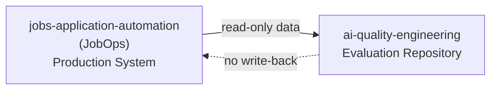
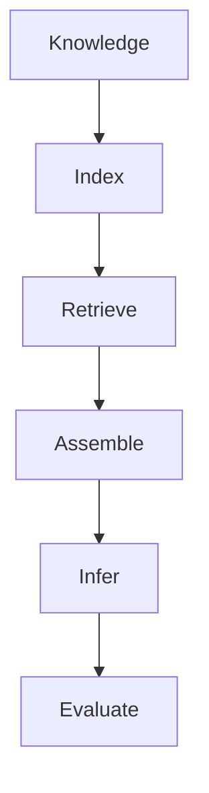
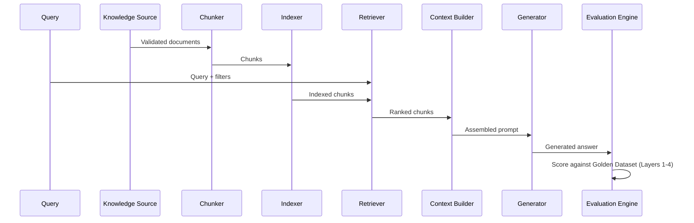

# Architecture Specification

**Repository:** `ai-quality-engineering`
**Status:** Milestone 0.5 — Architecture Locked
**Related documents:** `docs/roadmap.md` (execution plan), `docs/altm.md` (failure diagnosis model), `docs/glossary.md` (terminology), `docs/interview-notes.md` (narrative framing)

This document is the technical constitution of the repository. It defines system design only — what exists, why it exists, and how it evolves across milestones. It does not describe how these decisions were arrived at (see `docs/roadmap.md`, Section 8) or how to diagnose failures once the system is running (see `docs/altm.md`).

---

## 1. Purpose

This repository is an **AI Quality Engineering evaluation laboratory**, not a chatbot or product application.

Its purpose is to validate AI system behavior — retrieval correctness, generation faithfulness, and regression stability — using the same engineering discipline already applied to ETL and data-platform testing: verified ground truth, layered validation, and reproducible evaluation, rather than informal manual spot-checking.

`jobs-application-automation` (JobOps) remains the production application. It owns job scraping, storage, and workflow automation. This repository consumes JobOps data as an evaluation corpus; it does not extend or operate JobOps.

> Terminology used throughout this document is formally defined in `docs/glossary.md`. This document focuses on architecture rather than terminology.

---

# Architectural Viewpoints

This document describes the architecture through four complementary viewpoints:

| Viewpoint | Purpose |
|-----------|---------|
| System View | How information flows through the AI evaluation pipeline |
| Repository View | How responsibilities are separated across repositories and directories |
| Component View | How individual components collaborate through interfaces |
| Evolution View | How the architecture changes across milestones without redesigning the system |

These viewpoints provide different perspectives of the same architecture rather than separate designs — Sections 3–4 correspond to the System View, Sections 3 and 6 to the Repository View, Sections 5 and 7 to the Component View, and Sections 8–9 to the Evolution View.

---

## 2. Architecture Principles

These are binding constraints on all design and implementation decisions in this repository.

| Principle | Statement |
|---|---|
| Docs before code | Architectural and scope decisions are written and frozen before implementation begins. |
| Interface-first design | Components are called through an interface, never a concrete implementation. Implementations are swapped in later without changing calling code. |
| Deterministic before probabilistic | Milestone 1A proves pipeline correctness using deterministic stubs before any embedding model or LLM is introduced. |
| Data validation before retrieval | Corpus integrity is checked before it is trusted as a retrieval source. |
| Evaluation-first | The evaluation strategy is designed before the system under evaluation is built. |
| Small, demonstrable milestones | Each milestone produces an inspectable, testable artifact — not a partial, unverifiable state. |
| Repository separation of concerns | Production data ownership and evaluation logic are never combined in one repository. |

---

## 3. Repository Boundary

Two repositories, single responsibility each, with a one-directional data relationship.



| Repository | Role | Owns |
|---|---|---|
| `jobs-application-automation` | Production system, source of truth | Job scraping, SQLite storage, dashboard, resume storage, workflow automation |
| `ai-quality-engineering` | Evaluation laboratory | Golden dataset, retrieval pipeline, evaluation harnesses, benchmark reports |

**Constraint:** `ai-quality-engineering` never writes to JobOps. It is treated as any other external, read-only production data source (comparable to consuming Salesforce, Jira, or a GitHub API as a data feed) — not as a component being co-developed with JobOps.

---

## 4. High-Level Architecture

Information moves through six stages. Each stage has a distinct responsibility, and each fails in a distinct way — which is why each stage is evaluated by a distinct method (Section 9, `docs/roadmap.md` Section 5).



| Stage | Purpose | Inputs | Outputs | Responsibility | Example Failure |
|---|---|---|---|---|---|
| **Knowledge** | Establish a trustworthy source corpus | Resume, job descriptions, JobOps SQLite | Validated document set | Freshness, completeness, hash integrity | A resume edit is not reflected in the corpus (stale source) |
| **Index** | Convert validated documents into retrievable units | Validated document set | Chunks + (later) vectors | Structural chunking, coverage guarantee | A bullet point is truncated mid-chunk |
| **Retrieve** | Fetch evidence relevant to a query | Query, indexed corpus | Ranked candidate chunks | Relevance, noise minimization | Right topic, wrong document version retrieved |
| **Assemble** | Build the final prompt from retrieved evidence | Ranked chunks, query | Assembled prompt | Fit within context window without silent truncation | Retrieved evidence correct but dropped during assembly |
| **Infer** | Generate an answer from the assembled prompt | Assembled prompt | Model output | Entailment to retrieved context | Model states a fact not present in retrieved evidence |
| **Evaluate** | Validate correctness, groundedness, and stability | Model output, expected outcome (Golden Dataset) | Pass/fail + metric scores | Layered evaluation (Section 9) | A regression in output quality goes undetected between versions |

This is a summary for architectural context. Stage-by-stage failure diagnosis, and how to trace a wrong output back through these stages, is the subject of `docs/altm.md` — not duplicated here.

---

## 5. Component Architecture

| Component | Responsibilities | Interface | Dependencies | Current Milestone | Future Evolution |
|---|---|---|---|---|---|
| **Knowledge Source** | Expose validated resume, job description, and JobOps data to the pipeline | `KnowledgeSource.load() -> List[Document]` | JobOps SQLite (read-only), resume file | 1A | Add cover letters, portfolio docs (future, out of scope now) |
| **Chunker** | Split documents into retrievable units along structural boundaries | `Chunker.chunk(doc: Document) -> List[Chunk]` | Knowledge Source | 1A — structure-aware primary strategy, recursive-character fallback | Chunk-size/overlap benchmarking |
| **Indexer** | Build a lookup structure over chunks | `Indexer.index(chunks: List[Chunk]) -> Index` | Chunker | **1B** — deterministic placeholder vectors | Real embedding integration |
| **EmbeddingProvider** | Convert text into vector representations | `EmbeddingProvider.embed(text: str) -> Vector` | — | **1B** — interface + stub only | BGE-small-en-v1.5 (Milestone 2 default) |
| **VectorStore** | Persist and query vector representations | `VectorStore.upsert(...)`, `VectorStore.query(...)` | EmbeddingProvider | **1B** — interface only, no implementation | FAISS (Milestone 2 default) |
| **Retriever** | Return ranked evidence for a query | `Retriever.retrieve(query, filters) -> RetrievalResult` | Indexer, VectorStore | 1A — SQL-filter stage implemented, exercised at 1B; semantic stage stubbed | Real BM25 + Vector + RRF fusion |
| **Context Builder** | Assemble retrieved chunks into a prompt within budget | `ContextBuilder.assemble(chunks, query) -> Prompt` | Retriever | 1A | Context-overflow handling under real token budgets |
| **Generator** | Produce an answer from an assembled prompt | `Generator.generate(query, retrieval: RetrievalResult) -> GenerationResult` | Retriever | 1A — deterministic stub generator | DeepSeek API integration |
| **Evaluation Engine** | Score outputs against the Golden Dataset across all four layers | Layer-specific: pytest / Ragas / DeepEval / Promptfoo | Golden Dataset, Generator, Retriever | 1A — Layer 1 (pytest) only | Layers 2–4 activated in Milestone 2–3 |
| **CLI** | Provide a reproducible local entry point tying the pipeline together | Command-line invocation | All of the above | 1A | — |

> **Component synchronization — Sprint P3.7.4.** Four rows above were amended under `docs/P3.7.3_Repository_Owner_Constitutional_Decision.md`.
>
> - **`Generator`** — interface and dependency corrected to the signature approved by `docs/GENERATION_CONTRACT.md` §22 (G-1, G-2) at Sprint P3.5.1-G and implemented at P3.5.2. This discharges the Repository Owner action §22 assigned and §20.3 barred implementing sprints from performing. Authorization **A5**. The row's *Future Evolution* column is unchanged and is revisited when DeepSeek integration lands (register **M2-14**).
> - **`Retriever`** — interface corrected to `-> RetrievalResult`, frozen by `docs/MILESTONE_1A.md` build item 4 (*"not a bare `List[Chunk]`"*). Authorization **A5**. The SQL-filter stage is implemented but not exercised over the committed corpus; exercising it is register **1B-07**.
> - **`Indexer`, `EmbeddingProvider`, `VectorStore`** — *Current Milestone* moved from `1A` to `1B` per the constitutional reassignment. Responsibilities, interfaces and *Future Evolution* are unchanged. Authorization **A7**; register **1B-01, 1B-02, 1B-03, 1B-04**.
>
> **`docs/architecture.md` §7's Protocol sketch is deliberately unchanged**, and consequently still shows the superseded `Generator.generate(prompt)` and `Retriever.retrieve(...) -> list["Chunk"]` shapes. Authorization A5 explicitly bars amending it: it illustrates interface *shape* and is amended only when the interface set changes. The binding signatures are the contracts and this table. Recorded as a known divergence in `docs/P3.7.4_Repository_Authority_Synchronization_Report.md`, not as an oversight.
>
> **The `Context Builder` row is deliberately unchanged**, and still reads *Current Milestone 1A* although `docs/GENERATION_CONTRACT.md` §21 excludes the Assemble stage from Milestone 1A and register **M2-12** allocates it to Milestone 2. No P3.7.3 authorization covers this row, and inferring one would broaden constitutional intent. Recorded as a residual divergence, deferred.

**Knowledge Manifest.** The Knowledge Source owns the Knowledge Manifest. `knowledge_manifest.json` is an artifact produced from the corpus, containing metadata that describes the corpus — it is not a separate pipeline component or interface. Corpus integrity and freshness validation consume this artifact directly. The canonical schema is defined in `docs/MILESTONE_1A.md`.

**Document.** The Knowledge Source component's output, consumed by the `Chunker`. The canonical Document Data Model and Contract are defined in `docs/DOCUMENT_CONTRACT.md`.

**Chunk.** The `Chunker` component's output, consumed by the `Indexer`. The canonical Chunk Data Model and Contract are defined in `docs/CHUNK_CONTRACT.md`.

---

## 6. Repository Structure

| Directory | Purpose |
|---|---|
| `docs/` | Governance artifacts — roadmap, architecture, ALTM, glossary, interview notes, learning log. Source of truth for design decisions. |
| `datasets/` | Golden Dataset and evidence-trace data (`datasets/golden/`), plus any experimental or fallback data (`datasets/synthetic/`) — see scope note in Section 11. |
| `evaluation/` | One subdirectory per evaluation tool — `deepeval/`, `promptfoo/`, `ragas/` — each owning its own configuration and test definitions. |
| `sample_rag/` | The pipeline under test — `retriever.py`, `generator.py`, `documents/`. This is the system being evaluated, not the evaluation logic itself. |
| `tests/` | pytest suite — primarily Layer 1 (Data Quality) validation in Milestone 1A. |
| `reports/` | Generated evaluation output — `baseline/` for first-run results, `regressions/` for Promptfoo diff output. |
| `scripts/` | Operational scripts (e.g., dataset regeneration, report generation) — not pipeline logic. |
| `notebooks/` | Exploratory analysis, not production code. |

Each directory has exactly one responsibility. Pipeline logic (`sample_rag/`) is kept separate from the logic that evaluates it (`evaluation/`, `tests/`) so that the system under test and the test harness cannot be silently coupled.

---

## 7. Interface Design

Interfaces are defined in Milestone 1A. Implementations are deliberately deferred to Milestone 2. This section shows interface shape only — no production code.

```python
class EmbeddingProvider(Protocol):
    def embed(self, text: str) -> list[float]: ...

class VectorStore(Protocol):
    def upsert(self, chunk_id: str, vector: list[float]) -> None: ...
    def query(self, vector: list[float], top_k: int) -> list[str]: ...

class Retriever(Protocol):
    def retrieve(self, query: str, filters: dict) -> list["Chunk"]: ...

class Generator(Protocol):
    def generate(self, prompt: "Prompt") -> "Answer": ...
```

**Why implementations are deferred:** the correctness of the pipeline's plumbing — does chunking preserve coverage, does retrieval respect filters, does context assembly stay within budget — is independent of which embedding model or LLM eventually fills the interface. Proving plumbing correctness with deterministic stubs first means Milestone 2's real integrations are validated against an already-correct pipeline, rather than debugging pipeline logic and model behavior simultaneously.

---

## 8. Data Flow

End-to-end path for a single query, at Milestone 1A fidelity (stub embedding/generation) and at Milestone 2 target fidelity (real embedding/generation) side by side.

Before the full sequence, it is useful to separate the pipeline into two independent lifecycles: one that prepares the corpus, and one that answers a query.

**Build-Time Lifecycle** — prepares the corpus before any user query exists:

```
Knowledge
    │
    ▼
Validation
    │
    ▼
Chunking
    │
    ▼
Indexing
```

**Query-Time Lifecycle** — executes independently for every incoming request using the prepared index:

```
User Query
    │
    ▼
Retrieval
    │
    ▼
Context Assembly
    │
    ▼
Generation
    │
    ▼
Evaluation
```

The full sequence diagram below shows both lifecycles interleaved as they actually execute:



| Stage | Milestone 1A | Milestone 2 |
|---|---|---|
| Chunking | Structure-aware, deterministic | Unchanged |
| Indexing | Placeholder vectors / hashes | Real embeddings (BGE-small) |
| Retrieval | SQL filter stage real; semantic stage stubbed | Full hybrid: SQL + BM25 + Vector → RRF |
| Generation | Deterministic stub | DeepSeek API |
| Evaluation | Layer 1 (pytest) only | Layers 2–4 (Ragas, DeepEval, Promptfoo) activated |

---

## 9. Milestone Evolution

**Milestone 1A**
- Data Quality Validation (pytest) — resume, chunk, and metadata validation before any retrieval logic runs
- Structure-aware chunking, deterministic
- Retriever: SQL-filter stage real; semantic stage stubbed behind the `Retriever` interface
- Deterministic stub `Generator` — no external LLM call
- CLI tying the above into a reproducible local run
- No vector database, no real embeddings, no LLM

**Milestone 1B**
- `Indexer` with deterministic placeholder vectors behind the `EmbeddingProvider` interface — *moved here from Milestone 1A by `docs/P3.7.3_Repository_Owner_Constitutional_Decision.md` Decision 5*
- `EmbeddingProvider` and `VectorStore` defined as interfaces, with no implementation behind either
- Corpus expansion — at least one job description, and JobOps structured data, so the SQL-filter stage is exercised for real
- DQ-5, DQ-6, DQ-7 — the three Data Quality checks blocked at Sprint P3.1.8.1
- Still no vector database, no real embeddings, no LLM, and no evaluation tool: `docs/MILESTONE_1A.md` criterion A-5 remains binding throughout

**Milestone 2**
- Real `EmbeddingProvider` implementation (BGE-small-en-v1.5 default)
- FAISS `VectorStore` implementation, with content-hash + last-indexed-timestamp freshness tracking against JobOps SQLite
- Real BM25 implementation
- Hybrid retrieval fully wired: SQL + BM25 + Vector → RRF
- DeepSeek `Generator` implementation
- Ragas evaluation activated (Layer 2 — retrieval quality)
- DeepEval evaluation activated (Layer 3 — generation quality)

**Milestone 3**
- Promptfoo regression harness activated (Layer 4)
- Production-readiness hardening (documented benchmark reports, GitHub Actions on push — stretch goal per `docs/roadmap.md`)

No milestone beyond these four is currently defined. Any new milestone requires a deliberate scope decision recorded in `docs/roadmap.md` before this document is updated to reflect it — the procedure Milestone 1B itself followed: `docs/P3.7.3_Repository_Owner_Constitutional_Decision.md` Decision 2 §2.2, recorded in `docs/roadmap.md` §1, then reflected here.

### Milestone Capability Matrix

The table below summarizes the same milestone evolution described above, capability by capability:

| Capability | Milestone 1A | Milestone 1B | Milestone 2 | Milestone 3 |
|------------|--------------|--------------|-------------|-------------|
| Golden Dataset | ✅ | ✅ | ✅ | ✅ |
| Data Validation | ✅ | ✅ | ✅ | ✅ |
| Chunking | ✅ | ✅ | ✅ | ✅ |
| Index Coverage | — | ✅ | ✅ | ✅ |
| Embeddings | Stub | Stub | Real | Real |
| Vector Store | Interface | Interface | FAISS | FAISS |
| Retrieval | Deterministic | Deterministic | Hybrid | Hybrid |
| Generation | Stub | Stub | DeepSeek | DeepSeek |
| Retrieval Evaluation | — | — | Ragas | Ragas |
| Generation Evaluation | — | — | DeepEval | DeepEval |
| Regression | — | — | — | Promptfoo |

> **Matrix synchronization — Sprint P3.7.4, authorization A7.** The **Milestone 1B** column and the **Index Coverage** row are added; **the Milestone 1A, 2 and 3 columns are preserved unchanged**, as A7 requires.
>
> One consequence is disclosed rather than silently corrected: the Milestone 1A cells for **Embeddings** (*Stub*) and **Vector Store** (*Interface*) record the milestone **as originally scoped**, not as delivered. Neither capability exists in the repository, and both are constitutionally reassigned to Milestone 1B (`docs/MILESTONE_1A.md` — *Repository Owner Scope Ruling (P3.7.3)*; register **1B-01, 1B-02, 1B-04**). Correcting those two cells would alter an existing column, which A7 bars; leaving them without this note would state something untrue. The note is the resolution.

---

## 10. Architectural Decisions

| Decision | Reason | Consequence |
|---|---|---|
| JobOps remains sole source of truth for production data | Avoids duplicating data ownership; evaluation corpus stays realistic and self-renewing | This repository must always treat JobOps as read-only; any staleness in JobOps is a Knowledge-stage risk owned by this repository's validation layer, not by JobOps |
| Evaluation repository kept separate from JobOps | Prevents evaluation logic from coupling to production application code; keeps each repository's responsibility singular | Cross-repository changes (e.g., schema changes in JobOps) must be tracked manually until an explicit sync mechanism is designed |
| Hybrid retrieval: SQL + BM25 + Vector → RRF | JobOps already contains structured data; ignoring it for vector-only retrieval would be a weaker, less realistic evaluation setup | Retrieval logic has three routes to validate instead of one, increasing Milestone 2 implementation and test surface |
| Interface-first design (`EmbeddingProvider`, `VectorStore`, `Retriever`, `Generator`) | Allows deterministic Milestone 1A implementation without blocking on model/infra choices | Milestone 1A code must be written against interfaces that have no real implementation yet — requires discipline not to leak stub-specific behavior into calling code |
| Three evaluation tools only (DeepEval, Promptfoo, Ragas) | Matches each tool to exactly one evaluation layer; avoids tool sprawl and overlapping coverage | Some capabilities offered by out-of-scope tools (e.g., Phoenix's observability, LangSmith's tracing) are not available in this repository |
| Minimal dependencies | Milestone 1A must be provable without external services or paid APIs | Real-world fidelity (actual retrieval quality, actual generation quality) is deferred until Milestone 2 |
| Docs before code | Prevents architecture debates from recurring mid-implementation | Milestone 0.5 (this document and its siblings) must be complete before Milestone 1A implementation resumes |
| Resume corpus stored as versioned `.docx` | The resume is a living knowledge source that evolves throughout the job search. `.docx` serves as the canonical, editable artifact, while PDF is generated only as a distribution format for job portals and recruiters. Versioned `.docx` files preserve traceability across evaluation experiments and eliminate synchronization between independently maintained source documents. | Knowledge ingestion operates on the canonical `.docx` corpus. PDF remains an external export artifact and is outside the scope of the evaluation pipeline. |

These decisions are locked. Revisiting any of them requires a deliberate redesign discussion, not an incidental change made while implementing a later milestone.

---

## 11. Out of Scope

Deferred intentionally. Not forgotten — do not reintroduce without a recorded scope decision in `docs/roadmap.md`.

| Item | Status |
|---|---|
| LangChain / LangGraph | Out of scope entirely |
| Agent orchestration, multi-agent frameworks | Out of scope entirely |
| MLflow | Conceptual only |
| LangSmith | Conceptual only |
| Phoenix (Arize) | Name recognition only |
| Distributed retrieval | Out of scope entirely |
| GPU optimization | Out of scope entirely |
| Production orchestration / deployment infrastructure | Out of scope entirely |
| A second GitHub project | Not planned |

Note on `datasets/synthetic/`: this directory exists in the current scaffold but has no defined role under the locked Golden Dataset design (`docs/roadmap.md` Section 2), which is explicitly reverse-engineered from real data rather than synthetic. Its purpose should be decided explicitly — repurposed, removed, or scoped to a specific documented use — before Milestone 1A writes data into it.

---

## 12. Relationship to ALTM

This document explains **how information flows** through the system — the components, interfaces, and stage boundaries that exist regardless of whether anything is currently broken.

`docs/altm.md` explains **how to diagnose a failure** once something has gone wrong — which stage to check, which metric applies, and why a metric passing at one stage doesn't guarantee correctness at an adjacent one.

The two documents are complementary, not redundant: this document is the map; ALTM is the debugging procedure for when the map doesn't match reality.

---

## 13. Document Stability

This document changes only when an architectural decision changes.

Implementation details belong in source code.

Operational observations belong in reports.

Learning history belongs in `docs/learning-log.md`.

Interview framing belongs in `docs/interview-notes.md`.

---

*This document is the canonical technical design reference for `ai-quality-engineering`. It should be revised when an architectural decision in Section 10 is deliberately revisited, or when a milestone in Section 9 is completed and superseded by the next.*
